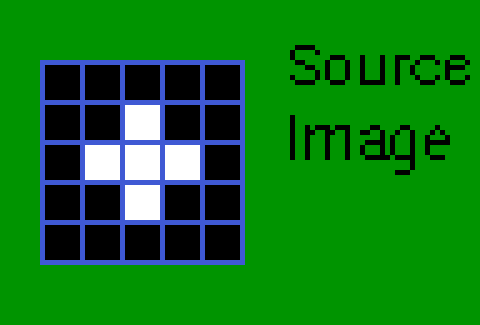
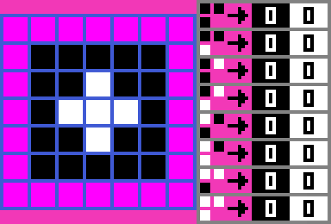
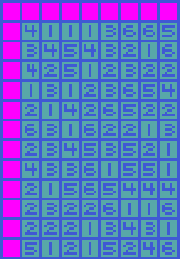
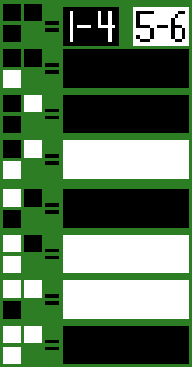
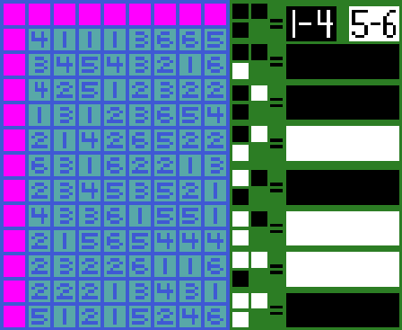
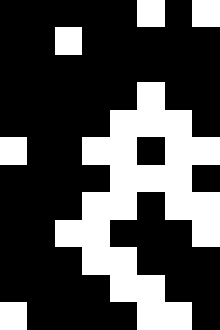

# Plus Image Seed Example Explanation
## Definitions Specific For This Document
* **Checked Position Defaults:** These are the **indexes** of *unique colors* only used when a *relative position* from the *cursor* reads a location that falls outside the image.
* **Cursor:** This is the position where the pixel being decided upon is located. It starts at the origin of the Image which is (0, 0) and goes through every *scan line* until either the generated image is fully generated or encountered an error with the error generation.
* **Image Seed** An image being used to generate a new `MarkovChainImageScanlineRules` Resource. The algorithm goes through the image with a cursor and predefined *Relative Positions* and 
* **Relative Position Checks:** These are the locations of previously generated pixels relative to the cursor where the pixel is being decided upon. Important: They must refer to past pixels because pixels past the cursor was not decided upon.
* **Rule-set** Another name for the `MarkovChainImageScanlineRules`.
* **Scan Line:** A scan line definition for this document is a row of pixels from (0, scan_line_index - 1) to (image_width - 1, scan_line_index). 0 <= scan_line_index < height.
* **Unique Colors** These are distinct color states that the rules can generate and read. From the source image, they every single color that exists in this image.
## Code Explanation
### Setting up the MarkovChainImageScanlineRules Resource.
#### Setup the Image Source Parameter
This code forms an embedded image which is a white '+' shape in the center of a 5x5 image. The rest of the image is black.
```gdscript
var source_image := Image.create_from_data(5, 5, false, Image.Format.FORMAT_L8,
		PackedByteArray([
		0x00, 0x00, 0x00, 0x00, 0x00,
		0x00, 0x00, 0xff, 0x00, 0x00,
		0x00, 0xff, 0xff, 0xff, 0x00,
		0x00, 0x00, 0xff, 0x00, 0x00,
		0x00, 0x00, 0x00, 0x00, 0x00]) )
```
#### Setup the Relative Position Checks Parameter
`relative_position_checks` sets up what areas relative to the cursor that the code would scan.

**The Cursor With the Relative Position Checks if Empty.**

**X** is a pixel location that has not been decided yet. This **might** be an invalid pixel location for the image.

**O** is the cursor in which the image is being generated upon. This **MUST** be a valid pixel location for the image.

**.** is a pixel location from the cursor that either lies image or is outside the image.

```
.........
.........
....OXXXX
XXXXXXXXX
XXXXXXXXX
```

```gdscript
var relative_position_checks: Array[Vector2i] = [
	Vector2i(-1, -1),
	Vector2i(-1,  0),
	Vector2i( 0, -1),
]
```
**R** This is the checked cursor location. This **might** be an invalid pixel location for the image. If that is the case then it uses the default color value rather than reading a pixel outside the image.
```
.........
...RR....
...ROXXXX
XXXXXXXXX
XXXXXXXXX
```
#### Setup the Checked Position Defaults Parameter
`checked_position_defaults` this sets up the default color indexes. Since black is the first unique color the default colors will be black. **IMPORTANT:** Make sure that this array is the same length as `relative_position_checks` and make sure that it does not exceed the unique colors found in the source image.
```gdscript
var checked_position_defaults: Array[int] = [0, 0, 0]
```
#### Setup the Invalid Color Parameter
The invalid color or #ff00ff is used to indicate that there are errors present in the image. **IMPORTANT:** Make sure that this color is not present in the source_image. 'create_rules' will fail if this is so.
```gdscript
var invalid_color := Color.FUCHSIA
```
#### Make the Rules from the Source Image and these Parameters.
This script produces the rules needed to generate images.
```gdscript
var ruleset := MarkovChainImageScanlineRules.create_rules(
		source_image, relative_position_checks, checked_position_defaults, invalid_color)
```


### Also, check the rules for any errors.
```gdscript
# Check if create_rules has failed
if !ruleset:
	# Error handling code
	return

# Check if ruleset has any errors.
var potential_error_str := ruleset.get_error_string()
if !potential_error_str.is_empty():
	# Error handling code using potential_error_str
	return
```

This statement should do nothing as `ruleset.get_known_state_factor()` is `1.0` for 100% pixel combinations because of the carefully chosen image_source, and relative pixel check locations/defaults.
```gdscript
if ruleset.get_known_state_factor() != 1.0:
    # Warn the user that the generated image might have cases where a
    # combination of pixels values is not present...
    pass
```
### Now, to Generate the image.
```gdscript
var generate_image_results: Dictionary[String, Variant]  = ruleset.generate_image(Vector2i(64,64))
```

Manually created example which shows how the algorithm works!

This depicts a random number table holding numbers one to six. These numbers are made to resemble a six faced dice. Note: My implementation uses a different random method to select random pixel values. This table is only to be used if random is needed. Note: Only the rule where the neighboring pixels are all black is when these values gets used for this particular rule-set.



These are the rules modified so they would work with six faced dice rolls.



This animation shows a simplified example of what generate image does step by step.



This is the output result.


